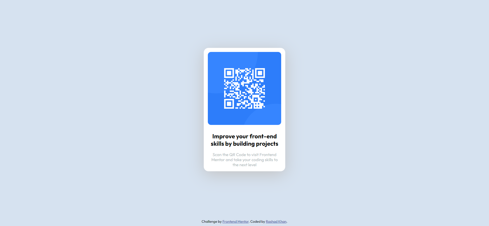

# Frontend Mentor - QR code component solution

This is a solution to the [QR code component challenge on Frontend Mentor](https://www.frontendmentor.io/challenges/qr-code-component-iux_sIO_H). Frontend Mentor challenges help you improve your coding skills by building realistic projects. 

## Table of contents

- [Overview](#overview)
  - [Screenshot](#screenshot)
  - [Links](#links)
- [My process](#my-process)
  - [Built with](#built-with)
  - [What I learned](#what-i-learned)
- [Author](#author)

## Overview

### Screenshot

#### Desktop


#### Mobile


### Links

- Solution URL: [QR Code Component](https://www.frontendmentor.io/solutions/qr-code-component-1rAq_4ISI7)
- Live Site URL: [QR Code Component](https://qr-code-component-ashy-three.vercel.app/)

## My process

### Built with

- Semantic HTML5 markup
- CSS custom properties
- Flexbox
- Mobile-first workflow

### What I learned

I learnt creating that for creating a responsive website one can make the main div flexbox as is done here and then use *justify-content* and *align-items* to center the div for every screen size.

```css
.container{
  background-color: transparent; 
  align-items: center;
  justify-content: center;
  display: flex;
  height: 97vh;
  }
```

## Author

- Website - [Rashad Khan]
- Frontend Mentor - [@rashadkhan359](https://www.frontendmentor.io/profile/rashadkhan359)

